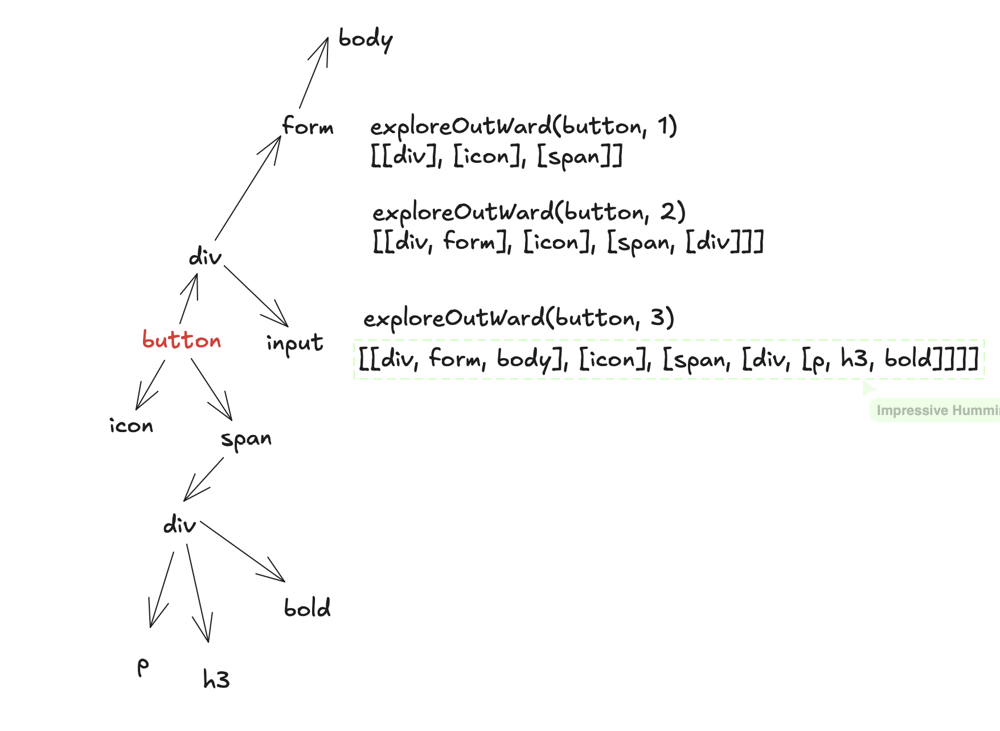

At Whatfix, we aim to replicate the DOM structure of a third-party website in our graph database. To achieve this, we have a global click listener attached to the document. Whenever a user clicks on an element, we capture the clicked element. Our goal is to explore the surrounding DOM structure relative to the clicked element and store this data in our graph database.

Write a function that takes an element and a threshold as inputs and returns an array of all elements that are exactly the specified threshold levels away from the clicked element in the DOM hierarchy.



```js
const exploreOut = (element, threshold) => {
	return [];
};
```

Output format,

```txt
[
  [p1, p2, p3],        // Direct parents at the current level
  [
    c1,                // Child element 1
    [c1a, c1b, c1c]    // Nested children of c1 (grandchildren of p1)
  ],
  [c2]                 // Another child at the same level
]
```
