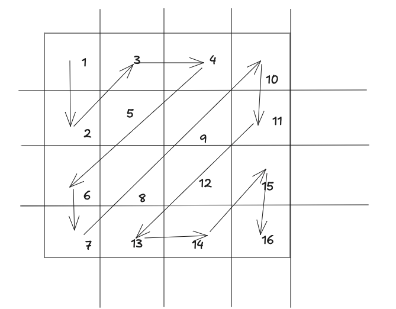

# Zigzag Traverse

Write a function that takes in an n x m two-dimensional array (that can be square-shaped when n == m) and returns a one-dimensional array of all the array’s elements in zigzag order.
Zigzag order starts at the top left corner of the two-dimensional array, goes down by one element, and proceeds in a zigzag pattern all the way to the bottom right corner.



```ts
const zipzag = (array: number[][]): number[] => {
    return [];
}
```
```ts
console.log(zigzag([
    [1, 3, 4, 10],
    [2, 5, 9, 11],
    [6, 8, 12, 15],
    [7, 13, 14, 16],
]));
// Output: [1, 2, 3, 4, 5, 6, 7, 8, 9, 10, 11, 12, 13, 14, 15, 16]

console.log(zigzag([
    [1, 2, 3, 4, 5, 6]
]));
// Output: [1, 2, 3, 4, 5, 6]

console.log(zigzag([
    [1], [2], [3], [4], [5]
]));
// Output: [1, 2, 3, 4, 5]

console.log(zigzag([
    [1, 3],
    [2, 4],
    [5, 7],
    [6, 8],
    [9, 10],
]));
// Output: [1, 2, 3, 4, 5, 6, 7, 8, 9, 10]
```
